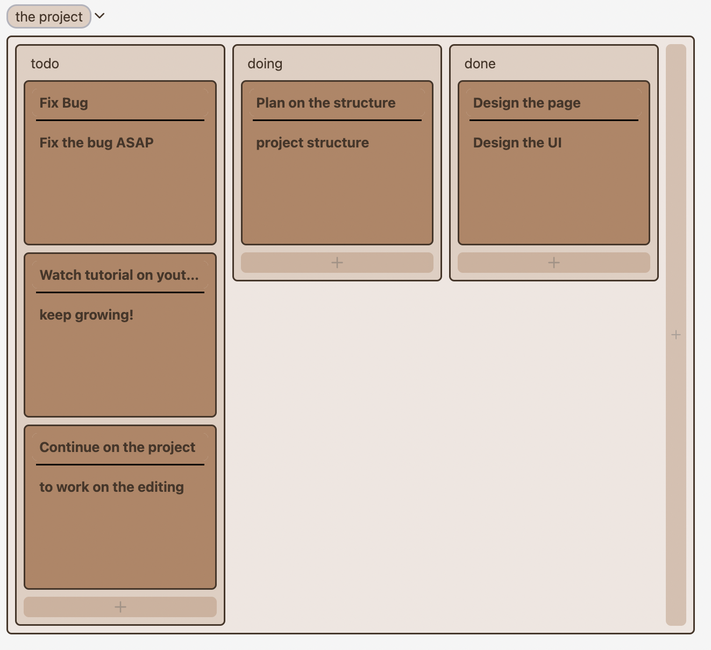

# Trello clone

<kbd>
</kbd>

## To run the project(docker compose)

```bash
make
```

- web app `localhost:3000`
- storybook `localhost:6006`

## To stop

```bash
make stop
```

## To clean

```bash
make clean
```
